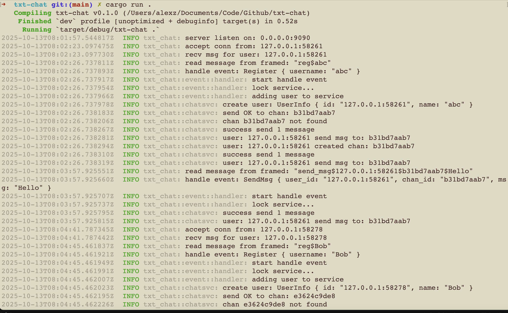

# Txt Chat


## Run

```sh
➜  ~ telnet 0.0.0.0 9090
Trying 0.0.0.0...
Connected to 0.0.0.0.
Escape character is '^]'.
register alice123
register$alice123
727af20893: alice123
```

```sh
2025-10-12T13:23:40.478250Z  INFO txt_chat: server listen on: 0.0.0.0:9090
2025-10-12T13:23:56.932698Z  INFO txt_chat: accept conn from: 127.0.0.1:63448
2025-10-12T13:24:04.202063Z  INFO txt_chat: read message from framed: "register alice123"
2025-10-12T13:24:04.202141Z  WARN txt_chat: error: cmd: register alice123 is not support
2025-10-12T13:24:25.356102Z  INFO txt_chat: read message from framed: "register$alice123"
```

## Broadcast message to users

- User: `abc`

```sh
➜  ~ telnet 0.0.0.0 9090
Trying 0.0.0.0...
Connected to 0.0.0.0.
Escape character is '^]'.
reg$abc
127.0.0.1:58261(2025-10-13 08:02:26.738247 UTC): channel created
127.0.0.1:58261(2025-10-13 08:02:26.738305 UTC): OK
send_msg$127.0.0.1:58261$b31bd7aab7$Hello
127.0.0.1:58261(2025-10-13 08:03:57.925773 UTC): Hello
join_chan$127.0.0.1:58278(2025-10-13 08:06:05.732685 UTC): joined channel success
send_msg$127.0.0.1:58261$b31bd7aab7$Hahahahah
127.0.0.1:58278(2025-10-13 08:09:11.631059 UTC): Awesome
127.0.0.1:58278(2025-10-13 08:09:46.186313 UTC): What's up Bro
send_msg$127.0.0.1:58261$b31bd7aab7$All Good 
127.0.0.1:58261(2025-10-13 08:10:07.032279 UTC): All Good
send_msg$127.0.0.1:58261$b31bd7aab7$Nice    
127.0.0.1:58261(2025-10-13 08:10:24.298530 UTC): Nice
127.0.0.1:58374(2025-10-13 08:11:41.022341 UTC): joined channel success
127.0.0.1:58374(2025-10-13 08:12:56.776003 UTC): Hello, Guys
```

- Bob

```sh
~> telnet 0.0.0.0 9090
Trying 0.0.0.0...
Connected to 0.0.0.0.
Escape character is '^]'.
reg$Bob
127.0.0.1:58278(2025-10-13 08:04:45.462274 UTC): channel created
127.0.0.1:58278(2025-10-13 08:04:45.462378 UTC): OK
join_chan$127.0.0.1:58278$b31bd7aab7
join$127.0.0.1:58278$b31bd7aab7
127.0.0.1:58278(2025-10-13 08:06:05.732685 UTC): joined channel success
send_msg$127.0.0.1:58278$b31bd7aab7$Awesome
127.0.0.1:58278(2025-10-13 08:09:11.631059 UTC): Awesome
send_msg$127.0.0.1:58278$b31bd7aab7$What's up Bro
127.0.0.1:58278(2025-10-13 08:09:46.186313 UTC): What's up Bro
127.0.0.1:58261(2025-10-13 08:10:07.032279 UTC): All Good
127.0.0.1:58261(2025-10-13 08:10:24.298530 UTC): Nice
127.0.0.1:58374(2025-10-13 08:11:41.022341 UTC): joined channel success
127.0.0.1:58374(2025-10-13 08:12:56.776003 UTC): Hello, Guys
```

- User: `Wang`

```sh
➜  ~ telnet 0.0.0.0 9090
Trying 0.0.0.0...
Connected to 0.0.0.0.
Escape character is '^]'.
reg$Wang
127.0.0.1:58374(2025-10-13 08:11:02.838468 UTC): channel created
127.0.0.1:58374(2025-10-13 08:11:02.838538 UTC): OK
join$127.0.0.1:58374$b31bd7aab7
127.0.0.1:58374(2025-10-13 08:11:41.022341 UTC): joined channel success
send_msg$127.0.0.1:58374$b31bd7aab7$Hello, Guys  
127.0.0.1:58374(2025-10-13 08:12:56.776003 UTC): Hello, Guys
```

